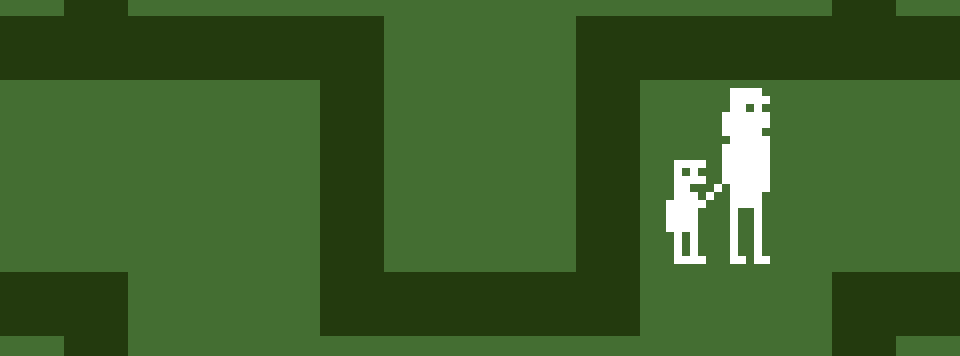

# *Let's Play: The Shining*

## [Play Online](https://www.pippinbarr.com/lets-play-the-shining/web/) (HTML5, not mobile-friendly)
## [Download for Mac](https://github.com/pippinbarr/lets-play-the-shining/releases/tag/mac)
## [Download for Windows](https://github.com/pippinbarr/lets-play-the-shining/releases/tag/windows)

## Description

Originally released on 22 Apri 2015, *Let&#8217;s Play: The Shining* is based on Stanley Kubrick&#8217;s movie _[The Shining](http://en.wikipedia.org/wiki/The_Shining_(film))_, which was in turn based on Stephen King&#8217;s book _[The Shining](http://en.wikipedia.org/wiki/The_Shining_(novel))_. It was written in [Haxe](http://haxe.org/) using the [HaxeFlixel](http://www.haxeflixel.com/) library. The music and sound effects in Let&#8217;s Play: The Shining were made with a combination of [bxfr](http://www.bfxr.net/), [Bosca Ceoil](http://distractionware.com/blog/2013/08/bosca-ceoil/), and [Audacity](http://audacity.sourceforge.net/). The graphics were made in [Pixen](http://www.pixenapp.com/).

In June of 2022 I was finally able to convince HaxeFlixel to rebuild the game as a browser-friendly HTML5 version. Nice!

## Press
 Let&#8217;s Play: The Shining was covered on [Kill Screen](http://killscreendaily.com/articles/lets-play-shining/), [A. V. Club](http://www.avclub.com/article/experience-kubricks-shining-way-it-was-meant-be-at-218591), [Madmoizelle](http://www.madmoizelle.com/shining-jeu-video-352153), [Warp Door](http://wip.warpdoor.com/2015/04/30/lets-play-the-shining-pippin-barr/), [FREEINDIEGA.ME](http://freeindiega.me/),  [iHorror.com](http://ihorror.com/check-out-this-playable-atari-2600-style-shining-mini-game/), [Forest Ambassador](http://forestambassador.com/post/129715989462/lets-play-the-shining-is-a-game-about), [Games Radar](http://www.gamesradar.com/shining-demake/?tag=grsocial-20), [International Business Times](http://www.ibtimes.co.uk/10-best-games-2015-youve-never-heard-crime-sexy-off-peak-sonic-dreams-more-1533605), and [Madmoizelle](http://www.madmoizelle.com/shining-jeu-video-352153).

## Exhibitions
It has also been exhibited at [GAMERZ 2015](http://www.festival-gamerz.com/gamerz11/) (here is a [video of that](https://vimeo.com/148353398)).

## Documentation
* Check out the [code repository](https://github.com/pippinbarr/lets-play-the-shining) (includes the original HaxeFlixel project and a new one I've been using to update the exports to HTML5, Mac, and Windows)
* Read the [design journal](../process/journal.md) to get some insight into what I was thinking about while making the game
* Download the [the original .swf file](https://github.com/pippinbarr/lets-play-the-shining/releases/download/v1.0/LetsPlayTheShining.swf) if you want

## License
*Let's Play: The Shining* is an open source game licensed under a [Creative Commons Attribution-NonCommercial 3.0 Unported License](http://creativecommons.org/licenses/by-nc/3.0/). You can obtain the source code from its [code repository](https://github.com/pippinbarr/lets-play-the-shining/) on GitHub.
