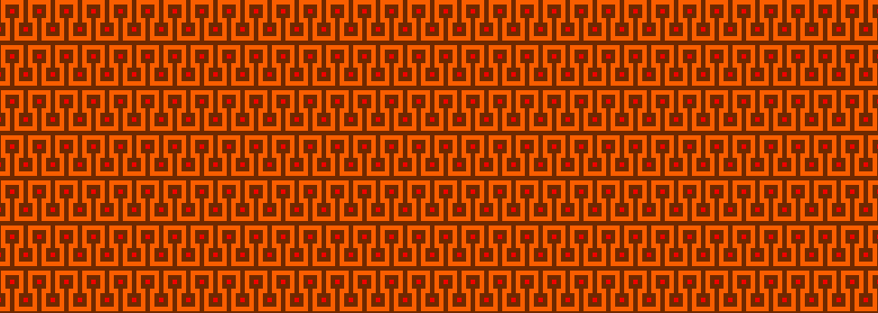
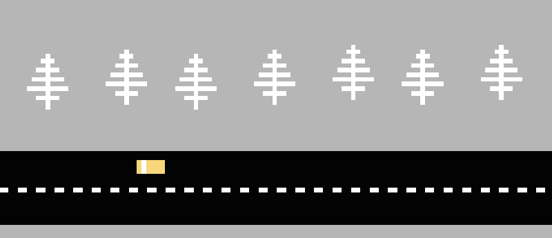
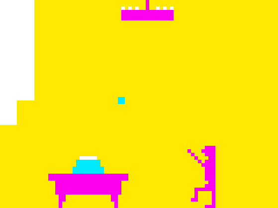
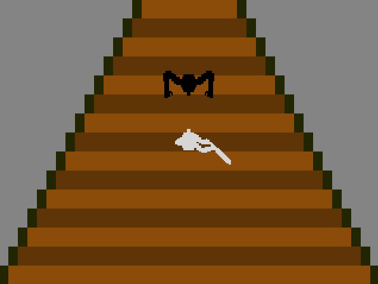
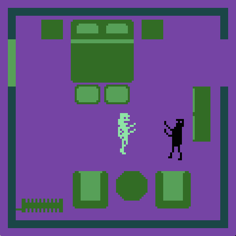
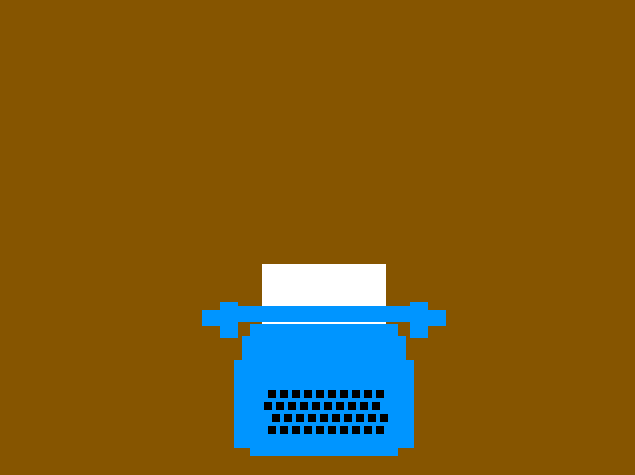
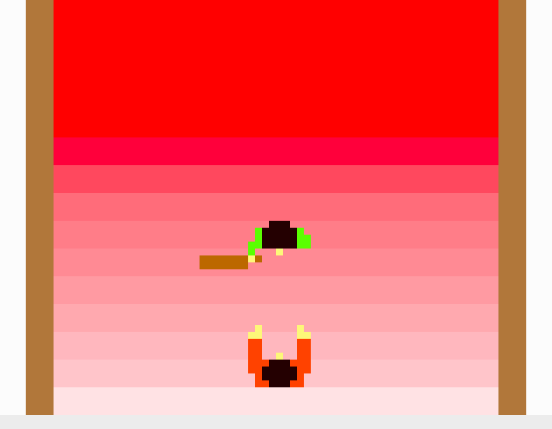
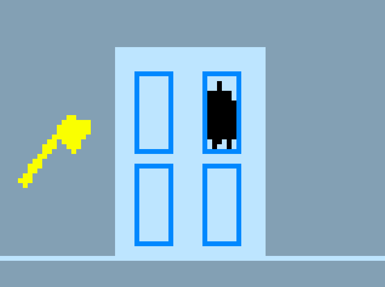
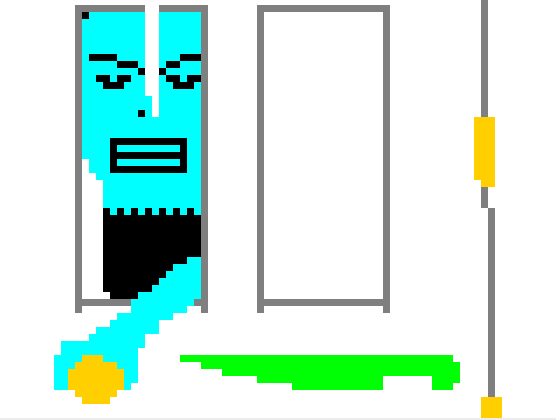
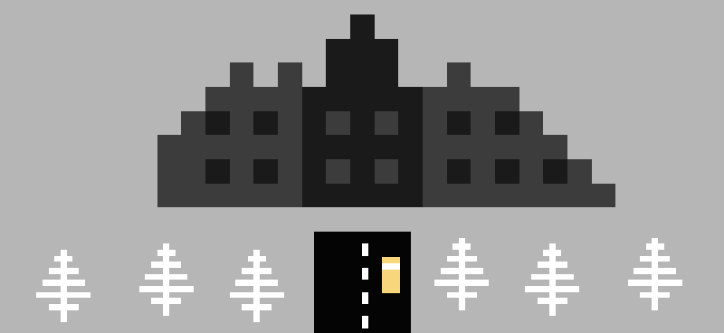

# Process journal

Herein lie the public-facing blog posts I wrote as I made *Let's Play: The Shining*.

## Shine On, You Crazy Dement. (2015-04-06)

I guess this post can serve as an announcement both that I&#8217;m claiming that I&#8217;m going to be writing posts again (in theory and in my heart of hearts) and also that I&#8217;m working on making a game based on or loosely &#8220;of&#8221; the movie _The Shining_.

This initial report is simply to tell you that I&#8217;m doing it, that I have managed to create a respectable low-resolution likeness of The Carpet, and that the whole thing has been a painful pain in the ass so far for various reasons. The two biggest reasons are that 1) adaptation is difficult, especially when you&#8217;re confused about what your baseline idea about the adaptation is, and that 2) making a game is very difficult until you nail a visual style. For me, anyway.

Having sorted both those things out just recently, I&#8217;m hoping to just power through the actual _making_ of the game &#8211; that bit&#8217;s trivial, right? I&#8217;m also hoping to write some posts about the process of feeling my way toward the &#8220;adaptation style&#8221; and the visual style and why it was all such an ass-pain along the way. So that&#8217;s something to look forward to I imagine.

That&#8217;s it. Night.

## When is The Shining not The Shining? (2015-04-08)

As threatened, I&#8217;m going to write some words about making this new game, now &#8220;officially&#8221; titled _Let&#8217;s Play: The Shining_. Not too many words, as I&#8217;m trying to ease back into this writing thing gently, but a few. A few mediocre words of a Wednesday evening.

One of the biggest struggles with this game has been coming up with an &#8220;identity&#8221; for it. Not so much the game itself as almost my understanding of &#8220;who is making it&#8221;. Now, obviously, _I_ am making it, but I mean that in a more stylistic sense. What sort of ethos is it made with, what sort of philosophy? Because understanding those things provides important constraints without which it generally feels impossible to proceed.

This game originally came about when I thought it would be funny to make a game that just follows Jack&#8217;s story through _The Shining_. (I mean, the movie borderline does this too, of course.) So it would be a sort of antihero thing where you find yourself doing bad stuff as the &#8220;hero&#8221; of the game. But this idea ran into a bit of trouble, oddly, when I was trying to title the game. I didn&#8217;t feel I could call it _The Shining_, because it wouldn&#8217;t actually be representative of the movie. And _The Shining: Jack&#8217;s Story_, while a bit hilarious, wasn&#8217;t completely what I wanted to capture. So, that one kind of fell away.

However, on thinking about calling the game literally _The Shining_ I started thinking about the idea of making a game representative of the movie. And then I started thinking about old games like _E. T._ that were made apparently kind of cynically to tie into a successful movie. And I liked that. So I tried to imagine I would make a game called _The Shining_ which was conceptually being made by some people at Atari trying to make a quick buck with a movie tie-in. With part of the joke here being that _The Shining_ wasn&#8217;t all that successful. Har har. This led me down various paths (which I will write about more when I look at some of the past visuals for the game), focused on adapting various Atari style graphics and gameplay into scenes from _The Shining_. I went pretty far down this road before feeling derailed by a lack of cohesive visuals.

What I ended up settling on is something a bit less meta that the Atari tie-in version. Now it&#8217;s a game of _The Shining_, but not titled _The Shining_ so as to avoid any charge of not getting it &#8220;right&#8221; and, in particular, not adapting the entire movie. Instead it&#8217;s _Let&#8217;s Play: The Shining_, which adds some of the levity I enjoyed from the Atari version without wedding me to retro-fidelity and strangely high-concept design tasks. Rather, the game refers back to my old game _Let&#8217;s Play: Ancient Greek Punishment_ and I think is thus allowed to be light, but still to include some of the play around being the bad guy (Jack chopping the door) and also the play around the idea of the cinematic (e.g. the opening car sequence) and playing around with the relationship specifically between game and movie (in this case particularly as concerns space and &#8220;control&#8221; by the hotel/player &#8211; deep right?)

So that&#8217;s a microcosm of what has been going on. Looking at it, it&#8217;s interesting to me how much this has revolved around, or at least been represented by, titling the game. The power of names.

## What Does The Shining Look Like? (2015-04-10)

The other thing I said I would write about concerning the current development of _Let&#8217;s Play: The Shining_ (which is going very well, thanks for asking) is the setting of the visual style as a way of making my way into being able to make the game. As it happens the visuals is a thing I really struggled with over the last few weeks, but then, on choosing a specific style, I found it incredibly easy to put together the required images. So let&#8217;s see&#8230; let me show you pictures. This could be embarrassing? Never mind.

I started off mostly doing drawings (in Pixen) to get some vague sense of how the screens could be laid out to encompass some sort of game play (this is obviously after having watched the movie and read the scripts and pulled out scenes in the first place). So these early images looked like this for instance:

In other words a pretty lazy throwing together of iconic bits and pieces with a garish colour scheme I was claiming to myself was &#8220;retro&#8221;. Looking back at it (and at, for instance, the Atari colours) I&#8217;m not so sure why I thought these colours were helpful. I was also pushing myself into a very low resolution which was leaving me pretty dissatisfied with what I could do &#8211; this was another misremembering of Atari games.

Eventually I went and played a bunch of Atari stuff and was reminded of a few things. Notably how much they mix resolutions and detail (e.g. the people in E.T. versus the buildings, say) and how their colours aren&#8217;t actually all gross like the ones I was using. In fact, I started wondering if I could actually make this game such that it served as a tribute to Atari games and their mechanics. Leading to something like this:

Yes, that&#8217;s the stairway scene with the baseball bat rendered as a version of Boxing on the Atari. I was pretty proud of this and I still think it would have turned out rather well. But in trying to commit to this idea of using diverse Atari games as reference points for different scenes, the whole thing felt like it got out of control visually &#8211; too much mixed style and colour. And further, I couldn&#8217;t always find an Atari game that made sense with what I was trying to do. The typing one was especially difficult, since relatively few Atari games focus on text.

At a certain point I made the kind of heartbreaking decision not to do Atari because it was simply diverting me too much from actually making the game. And it&#8217;s not just that it was &#8220;hard&#8221; (which it was), but much more that the trick of making different Atari-styled games wasn&#8217;t really contributing to making a game of _The Shining_ specifically. So I made the executive decision to return roughly to the style of _Let&#8217;s Play: Ancient Greek Punishment_, which is one I like, that is appropriately stripped back and somewhat Atari-like, but also feels fairly contemporary to me for whatever reason. (As a tribute to the Atari idea, I&#8217;ve been using the Atari palette.)

When I made that decision, and particularly the decision of what a &#8220;person&#8221; looks like, making the scenes for the game became rather straightforward. You draw the characters and then you just draw the environments around them based on their size and on reference pictures from the movie, while making sure to abstract away as much detail as possible without killing the settings. Leading to scenes that look like this:

And that&#8217;s the journey of the visual style for _Let&#8217;s Play: The Shining!_ Here are some vaguely embarrassing other images (not in the final game) to round it out with so you can see just how terrible I am prepared to be!

## The Code Comes Shining Through (2015-04-13)

I&#8217;m still working on this game I&#8217;m calling _Let&#8217;s Play: The Shining_. I&#8217;ve already written the two little things I had on my mind initially, but I also have other half-baked nonsense to put down, and since I have no real sense of an audience to this blog, I think I shall just feel completely free to write it on out. So the other thing I was thinking about something like this&#8230;

I was making the scene in which Danny rides his tricycle around the halls of the Overlook Hotel, for which you can see the spritesheet in the header of this post. I&#8217;ve generally been searching for &#8220;endings&#8221; to the scenes in the game, because they don&#8217;t always have natural game-based endings. In this particular scene it ends when Danny encounters the twins, as per the movie. So you ride the tricycle into a section of hallway, hit an invisible trigger, the twins appear, and the scene is over.

In my initial writing of the underlying code, when you stop I play the standard &#8220;idle&#8221; frame of the animation (the first one in the strip above) because that&#8217;s the standard behaviour of the sprite &#8211; if it stops it is &#8220;idle&#8221; and so it plays its &#8220;idle frame&#8221;. That&#8217;s obviously fine and dandy. But then at some point I was thinking about the movie and how it feels when Danny stops his tricycle on seeing the twins and the way he stops is that he&#8230; well, he just stops. There&#8217;s not some resetting to a rest position. Importantly, part of the emotional &#8220;point&#8221; or &#8220;impact&#8221; of the scene resides in that immediate stopping, all activity instantly suspended. Which meant that in the game you shouldn&#8217;t play a separate idle frame, rather you should stop the animation at the precise frame when the twins appear and Danny stops &#8211; whatever position his peddle is in. That is more &#8220;true&#8221; to the film.

Now this is, I think we can all agree, a very, very specific and atomic detail &#8211; which frame of an animation to display at a particular moment in time &#8211; but I think it&#8217;s really clear, too, that it&#8217;s an important detail and that it&#8217;s important in relation to the film and to the &#8220;emotional truth&#8221; of that moment in the film. And I think there&#8217;s something quite interesting there. It makes me wonder about all the other very specific lines of code or frames of animation that exist in this game and to what extent they do or do not serve such purposes. Most importantly, I think it&#8217;s great that this is even possible, and I think it&#8217;s interesting in the context of the idea of &#8220;adaptation&#8221; and games &#8211; particularly because we&#8217;re adapting not just visuals or sounds but _actions_ themselves. It&#8217;s not just how game-Danny looks or sounds but how he _reacts_ in the moment, and how that reaction is tied to the interactivity, the actions, of the game.

There.

## Making Sound for The Shining When You Don't Know Anything About Sound (2015-04-18)

I guess this is intended to be a &#8220;process post&#8221; about making the sounds and music in _Let&#8217;s Play: The Shining_, but it has the special(?) quality of being about a subject I know very, very little about. So really it&#8217;s about muddling through the sounds needed for a game like this, and how I managed despite my deficiencies. I can still imagine it being helpful, though, to those of you who are similarly at sea with sounds/music yet are simultaneously determined to do it themselves. So.

The easiest sounds were in the category of &#8220;anything I can make in [bfxr](http://www.bfxr.net/)&#8220;, because that&#8217;s a truly great piece of software for you if the kinds of sounds it makes fit in with your game aesthetic. If you haven&#8217;t used bfxr before, you&#8217;re missing out &#8211; frankly, even if you don&#8217;t make games it&#8217;s a lot of fun to click around in. It has some pre-established categories (like &#8220;laser&#8221; or &#8220;hurt&#8221;) that put together a &#8220;kind&#8221; of sound, and then you can tweak an impressive array of buttons and sliders to fit it to what you want. I generally find myself doing a lot of tweaking, but I suspect it&#8217;s at least half because I want to feel like I exerted creative agency, more than that I&#8217;m improving the sound. Most importantly, it&#8217;s a tool that gives you a &#8220;draft&#8221; sound more or less instantly, which is always the hardest bit. The tweaking is then like a little game of itself as you search for the &#8220;right sound&#8221; of whatever you&#8217;re doing (a baseball bat swinging, a head being hit, a ball being caught).

The hardest sound effect for me was the sound of Danny&#8217;s tricycle when it&#8217;s on a non-carpeted floor. The sound of the tricycle is an iconic part of the movie, so it had to sound at least evocative of that. To make that sound (which let me say up front I don&#8217;t think worked perfectly at all) I used [Audacity](http://audacity.sourceforge.net/), because I wanted something that would loop. So began an appalling process of combining different generated tones to try to make something approximating the tricycle on hard flooring (that is, something that would sound like that would sound in a game, so a kind of second order thing). As I said, I don&#8217;t think I got it right, but it was kind of fun playing with different frequencies of saw waves and square waves and sine waves overlaid. I found something, but then got feedback that it sounded too low, so started from scratch and made something a bit higher but with a lower tone in the background. All in all it was a great insight into how freaky-smart sound/music people must actually be, given their ability to construct these sorts of sounds with some confidence and naturalness.

Finally there&#8217;s the music. In a sense this was &#8220;easy&#8221; because the music already exists. I spent a fair while trying to piece together the opening theme on the keyboard in Garage Band and got close, but managed to have it in the wrong key (I&#8217;m not a pianist). Then I realised that this is the kind of thing you can look up online and found the notes nicely written down. The closing song (Midnight, the Stars, and You by Al Bowlly) was a bit harder because it proved difficult to find the melody written down anywhere (I did find guitar chords). Eventually I solved this when I found [someone playing the tune on YouTube](https://www.youtube.com/watch?v=DJ7dvLvVqcE) with a top-down view of their fingers on the piano and transcribed the notes manually. With the notes established I used Terry Cavanagh&#8217;s excellent little music tool [Bosca Ceoil](http://distractionware.com/blog/2013/08/bosca-ceoil/) to actually sequence it. This did involve a slight &#8220;misuse&#8221; of Terry&#8217;s program, which isn&#8217;t designed for melodies of this kind (it&#8217;s more for looping music, which it&#8217;s great at), but it was fine to break the melody into chunks that fit into Bosca Ceoil&#8217;s &#8220;patterns&#8221;.

Then it was just a matter of choosing an instrument. I started off being a purist about only using classic waveforms (saw, sine, square), but actually ended up using &#8220;Triangle Lo-Fi&#8221;, which has a warmer sound to it, for the closing theme, and then decided to just use that for the opening as well. Part of &#8220;being able&#8221; to use that instrument (which sounds &#8216;nicer&#8217;) was all tied up in that same struggle to establish within myself that I wasn&#8217;t making an authentically Atari-style game and could thus afford go more for things that felt right for the game/movie rather than for the imagined platform. Weird problem to have, but it&#8217;s a real one.

Anyway, that&#8217;s how the game sounds the way it does. Hopefully it&#8217;s vaguely novel to see how someone a bit inept struggles through and gets (what I think is) a pretty okay result!

## Let's Ask: How Many People Played Let's Play: The Shining: ? (2015-04-30)

Like many (most?) people who Make Things, I spend a fairly good amount of time fretting or at least watching how many people look at (play) the things I Make. So obviously I have webstats (kind of amateurishly maintained) on my various games, going back pretty much all the way to the beginning (with a couple of exceptions of games hosted by other people, notably [Jostle Bastard](http://www.pippinbarr.com/2013/11/19/jostle-bastard/) and [Jostle Parent](http://www.pippinbarr.com/2015/04/10/jostle-parent/) hosted on [Unwinnable](http://www.unwinnable.com/)).

A big question I often ask myself is the unanswerable: _how many plays of one of my games counts as _good_???_ But then I also don&#8217;t really report on how many people actually played them, so I&#8217;m not exactly helping anyone else get a lay of the land. So in the interests of &#8220;honesty&#8221; or whatever it is, I thought I&#8217;d at least show you how many people have played [Let&#8217;s Play: The Shining](http://www.pippinbarr.com/2015/04/22/lets-play-the-shining/) so far. The numbers are trending down at this point so, barring an uptick, this is pretty representative of the &#8220;first flush&#8221; of interest in the game when people wrote about and tweeted it etc. Maybe someone else will pick it up and it will surge again, but that doesn&#8217;t usually happen (in my personal experience).

So since I released it on the 21st of April, roughly eight days ago, Let&#8217;s Play: The Shining has been played by 18,617 &#8220;unique&#8221; people. Bearing in mind that what &#8220;unique&#8221; means is defined in terms of timing and IP addresses and so on and may not reflect a literal thing. But let&#8217;s say that&#8217;s &#8220;how many people&#8221; have (ever) played Let&#8217;s Play: The Shining. More than 18,000 people. It&#8217;s a lot. Is it? This is what I don&#8217;t know. Depends on what you mean.

To me, just in the abstract, it&#8217;s a lot of people. They could populate a decent-sized town where &#8220;people who have played (or at least glanced at) Let&#8217;s Play: The Shining&#8221; live, for instance &#8211; they would all have that in common as they went about their lives as bakers, dentists, accountants, game developers, etc. It&#8217;s also &#8220;a lot&#8221; in the history of my games. It isn&#8217;t the most by a long, long shot, but in terms of opening spike it&#8217;s probably in the top five I think, and quite a lot more than many, many of my games get played.

As for how much other web games get played? I just don&#8217;t know. Obviously on websites like [GameJolt](http://gamejolt.com/), say, or [Newgrounds](http://www.newgrounds.com/), we can see that many games are played tens or hundreds of thousands of times, even millions, so Let&#8217;s Play: The Shining isn&#8217;t in that &#8220;league&#8221;. But then it&#8217;s also &#8220;not really a game&#8221; (or whatever) and pretty niche, and its &#8220;discoverability&#8221; is limited to me tweeting/posting and the kindness of journalists and tweeters passing it around.

So I don&#8217;t have an answer to whether it&#8217;s &#8220;a lot&#8221; except to say that to me it is, that I&#8217;m glad that many people have had a look at it, that I&#8217;m happy with that number. Frankly, on a good day, when I&#8217;m not being megalomaniacal, I&#8217;m kind of astounded that even 100 people might play something I made. That&#8217;s still so many people!

As a last amusement, the average time spent with the game is roughly four and a quarter minutes. So those roughly 18,000 people spent a total of 76,500 minutes on my little game. Which is 1275 hours, or 53.125 days. Almost two months of human time.

The internet. The more you know.
